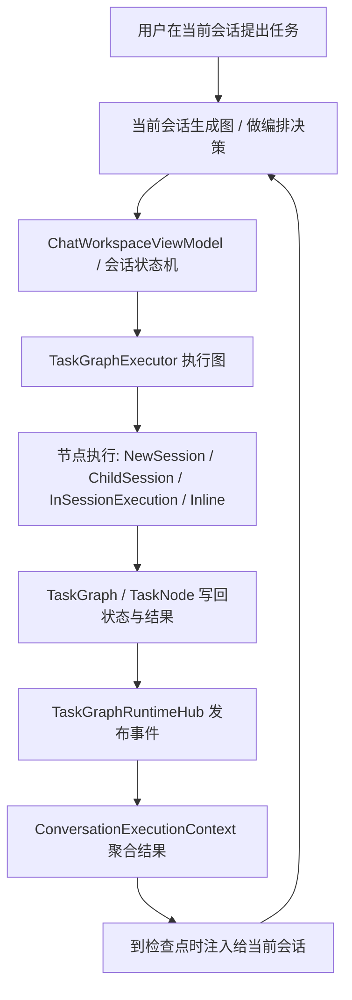
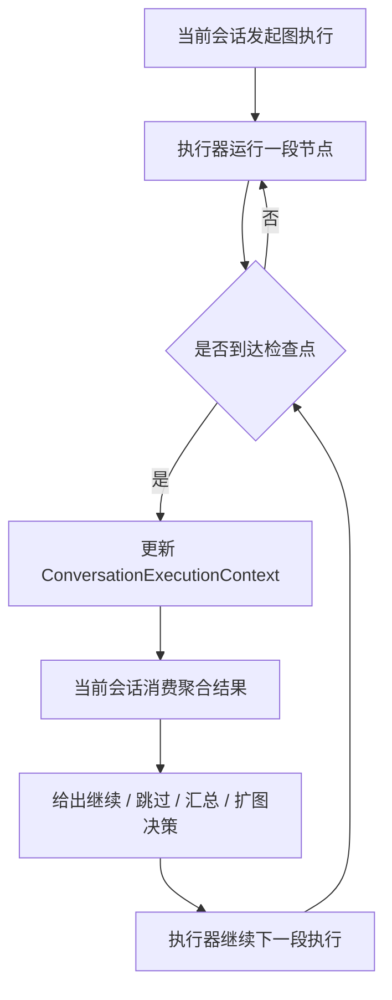
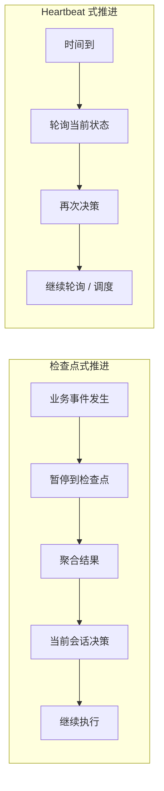
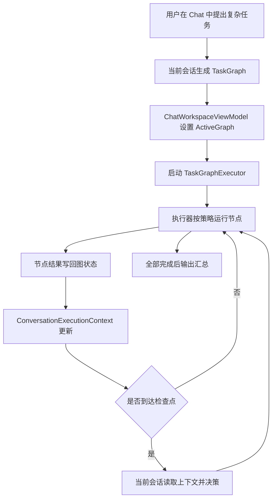
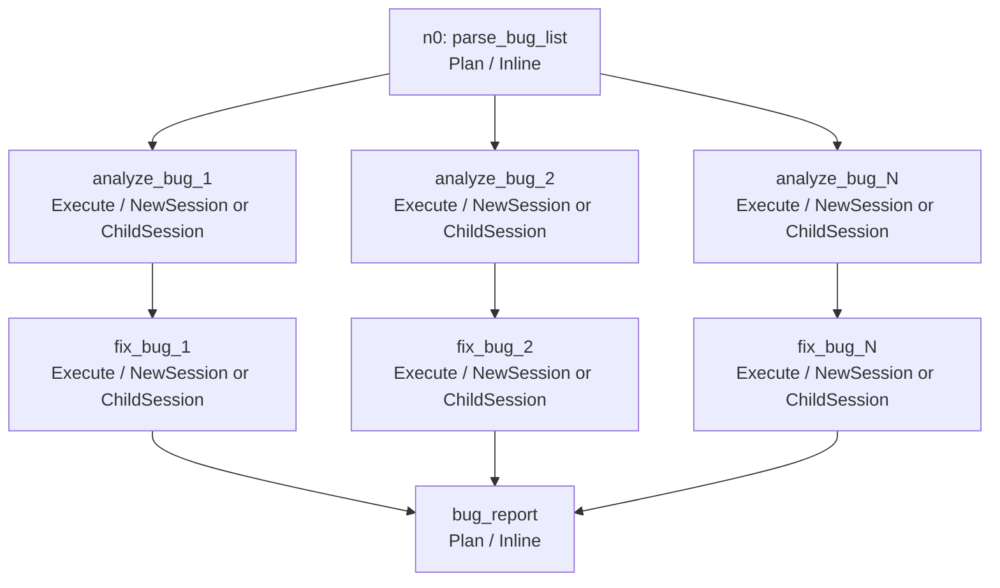

# TaskGraph 对话内 Orchestrator 开发方案

> 状态: 已实施 (2026-06-22) — 本文档保留作为设计记录与回溯参考
> 日期: 2026-06-21
> 适用范围: AgentOrchestrator TaskGraph v3 对话内编排
>
> 当前实现见 `Docs/developer/architecture.md` 中「TaskGraph In-Conversation Orchestrator」一节。

---

## 1. 文档目的

本文给出一份可直接进入开发设计与分阶段实现的方案，用于将 TaskGraph 从“用户点击触发的独立执行器”演进为“当前会话作为控制面、应用执行器作为执行面”的对话内 Orchestrator。

本文是独立方案，不依赖其它讨论文档才能理解。

---

## 2. 背景与问题

当前 TaskGraph 已有以下能力:

- 图模型、编辑、持久化
- 图生成与节点执行
- 失败重试、继续执行、有限扩图
- 独立 TaskGraph 工作区中的运行状态展示

当前实现的关键限制是:

1. 图执行主要由用户在 TaskGraph 工作区手动点击触发
2. `TaskGraphExecutor` 是“跑到底”的应用内执行器
3. 当前 chat session 不是图执行过程中的真正控制中心
4. 图结果主要通过 UI 可见，而不是作为当前会话可消费的上下文回流

因此，当前实现更接近:

- 图形化批处理执行器

而不是:

- 当前会话驱动的对话内 Orchestrator

---

## 3. 目标

### 3.1 核心目标

本方案要达成以下目标:

1. 当前会话成为 TaskGraph 的控制面
2. `TaskGraphExecutor` 成为应用层执行面
3. 图执行结果能够以结构化方式回流给当前会话
4. 当前会话能够在检查点上基于图结果做下一步决策
5. v3 首版不依赖 OpenCode subagent

### 3.2 非目标

本方案明确不做:

- OpenCode subagent 集成
- 心跳式持续轮询编排
- 多图并发执行
- 多级嵌套代理树
- 完整图结构自重写
- 分布式后台 worker 体系

---

## 4. 关键结论

### 4.1 不使用 OpenCode subagent

v3 不使用 OpenCode subagent。

原因:

- TaskGraph 作为应用层编排器可以独立成立
- subagent 会引入额外运行时语义和双重编排复杂度
- 当前重点是让“当前会话”和“应用执行器”形成清晰分工

v3 的执行路径只基于:

- `NewSession`
- `ChildSession`
- `InSessionExecution`
- `Inline`

### 4.2 当前会话不是直接执行器，而是控制面

当前会话负责:

- 发起编排
- 生成图
- 消费执行结果摘要
- 在检查点做下一步决策

当前会话不直接负责:

- 调 OpenCode API 创建 session
- 执行节点
- 维护图状态机

这些由应用层执行器负责。

### 4.3 执行器采用检查点式推进

v3 不采用 heartbeat 式持续高频互动。

采用:

- 事件驱动
- 检查点暂停
- 聚合结果回灌
- 当前会话低频决策

这比 heartbeat 更适合当前 TaskGraph 的 DAG 结构、前台用户驱动模式和上下文成本约束。

---

## 5. 架构总览

### 5.1 总体分层

```text
当前会话（控制面）
  ├─ 用户意图输入
  ├─ 图生成 / 策略决策
  ├─ 消费执行结果上下文
  └─ 在检查点决定继续、跳过、汇总、扩图

ChatWorkspaceViewModel / 会话状态机
  ├─ 管理 ActiveGraph
  ├─ 管理 ChatExecutionLease
  ├─ 维护 ConversationExecutionContext
  └─ 向 TaskGraphExecutor 下达控制命令

TaskGraphExecutor（执行面）
  ├─ 根据图和节点策略执行
  ├─ 调用 IAgentGateway 创建 session / child session
  ├─ 收集节点输出并回写图状态
  └─ 在检查点停止并发布事件

TaskGraphRuntimeHub
  ├─ 发布运行时事件
  └─ 驱动 UI 和上下文桥接层更新

TaskGraph / TaskNode（状态真相）
  ├─ 节点状态
  ├─ 图状态
  └─ 输出摘要 / 结构化结果 / 依赖关系
```

### 5.2 Orchestrator 总览图



### 5.2 Source of Truth

必须固定以下原则:

- `TaskGraph` / `TaskNode` 是执行真相
- `TaskGraphRuntimeHub` 是事件通道
- `ConversationExecutionContext` 是当前会话消费用投影

任何会话层状态都不能反向替代图状态真相。

---

## 6. 控制面与执行面分权

### 6.1 当前会话负责什么

当前会话负责:

- 识别用户是否要启动图编排
- 生成图或选择模板生成图
- 根据已有结果决定是否继续执行
- 根据检查点结果决定是否追加节点
- 在等待输入时收集用户决定
- 请求图状态摘要和阶段性总结

### 6.2 执行器负责什么

执行器负责:

- 根据 DAG 找到当前可执行节点
- 按节点策略选择执行路径
- 创建 session / child session
- 发送节点 prompt
- 收集消息与输出结果
- 更新节点状态和图状态
- 在检查点发布暂停与结果事件

### 6.3 不允许模糊的边界

不允许出现以下情况:

- 当前会话和执行器都可以决定下一个节点
- 当前会话和执行器都可以直接写入图状态
- 当前会话绕过执行器直接发起图节点运行

---

## 7. 执行模型

### 7.1 执行路径

每个节点采用以下策略之一:

```csharp
public enum TaskNodeDelegationStrategy
{
    NewSession = 0,
    ChildSession = 1,
    InSessionExecution = 2,
    Inline = 3,
}
```

### 7.2 各策略含义

#### `NewSession`

- 创建新的顶层 session
- 适合隔离、重试、并行、文件修改类任务

#### `ChildSession`

- 创建带 `ParentID` 的 session
- 用于表达父子归属关系
- 不把“自动共享上下文”作为前提

#### `InSessionExecution`

- 不创建新 session
- 直接在当前 chat session 中执行节点
- 只适合轻量、强对话关联任务

#### `Inline`

- 不作为独立 agent 节点执行
- 作为轻量推理步骤运行
- 只用于规划、总结、决策等节点

---

## 8. 为什么采用检查点式推进

### 8.1 定义

检查点式推进指:

- 执行器连续执行一段图
- 到明确业务事件后暂停
- 将聚合结果回灌给当前会话
- 当前会话给出下一步决策
- 执行器继续下一段执行

对应流程如下:



### 8.2 首版检查点

首版建议只在以下时机建立检查点:

1. 节点完成后
2. 节点失败后
3. 图进入等待输入状态后
4. 图发生受控扩图后

### 8.3 不采用 heartbeat 的原因

heartbeat 式编排是按时间周期持续巡视和决策。

本方案不采用 heartbeat，原因:

- 当前系统是 DAG 驱动，不是开放式队列调度
- 当前系统是前台用户驱动，不是后台多 worker 巡检
- 高时间频率交互会迅速膨胀 prompt 和状态同步成本
- 执行器与当前会话容易出现重复决策和状态竞争

结论:

- v3 采用“事件驱动 + 检查点暂停”
- 不做“定时轮询 + 高频重决策”

两种模式的差异如下:



---

## 9. 会话级上下文桥接层

### 9.1 目标

解决“图执行结果如何真正回流给当前会话”的问题。

这里的关键不是 UI 能看到结果，而是当前会话在后续 prompt 中能消费这些结果。

### 9.2 数据结构

建议新增:

```csharp
public sealed class ConversationExecutionContext
{
    public string ConversationSessionId { get; init; } = string.Empty;
    public string GraphId { get; init; } = string.Empty;
    public bool HasExecutionLease { get; set; }
    public string? CurrentRunningNodeId { get; set; }
    public string? GraphSummary { get; set; }
    public List<NodeSummarySnapshot> RecentCompletedNodes { get; } = [];
    public List<NodeFailureSnapshot> RecentFailedNodes { get; } = [];
    public List<PendingDecisionSnapshot> PendingDecisions { get; } = [];
    public List<GraphMutationSnapshot> RecentMutations { get; } = [];
    public DateTimeOffset UpdatedAt { get; set; }
}
```

### 9.3 设计原则

- 一个当前会话同一时间只绑定一个 `ActiveGraph`
- 只存聚合结果和最近窗口，不存全量日志
- 它是当前会话消费图结果的桥接层，不是新的状态真相

---

## 10. 结果回灌策略

### 10.1 必须回灌的内容

- 节点完成摘要
- 节点失败摘要
- 待人工决策项
- 当前阻塞原因
- 关键文件修改摘要
- 图结构追加摘要

### 10.2 不直接回灌的内容

- 全量 stream chunk
- 大段原始模型输出
- 重复性工具日志
- 无结论价值的中间心跳状态

### 10.3 节点摘要示例

```text
Node: analyze_bug_3
Status: Completed
Summary:
- 已定位问题在 UserListViewModel 的分页恢复逻辑
- 第 5 页崩溃由 null page token 导致
TouchedFiles:
- src/.../UserListViewModel.cs
SuggestedNextAction:
- continue fix_bug_3
```

---

## 11. 回灌时机

### 11.1 运行中

运行中默认只更新:

- `TaskGraph`
- `TaskGraphRuntimeHub`
- `ConversationExecutionContext`

### 11.2 当前会话真正消费结果的时机

当前会话在以下时机消费这些结果:

1. 图到达检查点
2. 图进入等待输入
3. 用户明确询问图状态
4. 当前会话需要做下一步编排决策

### 11.3 首版原则

首版不把大部分节点结果直接写入正式 chat 历史。  
默认通过隐藏执行上下文注入到下一次 prompt。

---

## 12. Prompt 注入策略

### 12.1 注入结构

建议在当前会话下一次参与决策前，注入如下上下文:

```text
Current TaskGraph execution context:
- Active graph: bug-list-20260621
- Running node: fix_bug_3
- Recently completed:
  - analyze_bug_2: ...
  - fix_bug_2: ...
  - analyze_bug_3: ...
- Recently failed:
  - none
- Pending decisions:
  - none
- Suggested next action:
  - continue fix_bug_3, then summarize phase-1 progress
```

### 12.2 控制长度

首版建议:

- 最近完成节点只注入 3 条
- 最近失败节点只注入 2 条
- 保留 1 条图级总体摘要
- 旧结果只做聚合，不再逐条注入

这样可以避免上下文无限膨胀。

---

## 13. ChatExecutionLease

### 13.1 目标

解决图执行与当前会话普通消息写入竞争问题。

### 13.2 规则

当图以 `InSessionExecution` 或 `Inline` 运行时:

- 执行器占用当前 chat session 写入权
- 普通用户消息入口禁用
- 其它自动写入路径禁用

释放时机:

- 当前检查点结束
- 图执行结束
- 图执行取消
- 图执行失败并退出当前会话路径

### 13.3 结论

没有 `ChatExecutionLease`，就无法可靠支持会话内执行路径。

---

## 14. 执行器接口演进

### 14.1 当前问题

当前执行器只有:

- `ExecuteAsync(...)`
- `RetryFailedAsync(...)`
- `ContinueAsync(...)`

这更适合“跑到底”的模式。

### 14.2 演进方向

建议演进为可检查点推进的接口集合，例如:

```csharp
public interface ITaskGraphExecutionController
{
    Task StartAsync(TaskGraph graph, TaskGraphExecutionRequest request, CancellationToken ct = default);
    Task ResumeAsync(string graphId, GraphContinueDecision decision, CancellationToken ct = default);
    Task PauseAsync(string graphId, CancellationToken ct = default);
    Task CancelAsync(string graphId, CancellationToken ct = default);
    Task<GraphExecutionSnapshot?> GetSnapshotAsync(string graphId, CancellationToken ct = default);
}
```

说明:

- 首版不一定要一次重命名所有接口
- 但内部必须按“可暂停、可恢复、可检查点继续”重构

---

## 15. 运行时事件

建议将 `TaskGraphRuntimeHub` 扩展为以下事件:

```csharp
public interface ITaskGraphRuntimeHub
{
    event EventHandler<TaskGraphChunkEventArgs>? ChunkReceived;
    event EventHandler<TaskGraphNodeEventArgs>? NodeChanged;
    event EventHandler<TaskGraphCheckpointEventArgs>? CheckpointReached;
    event EventHandler<TaskGraphExecutionEventArgs>? ExecutionStateChanged;
    event EventHandler<TaskGraphDecisionEventArgs>? DecisionRequested;
    event EventHandler<TaskGraphMutationEventArgs>? GraphExpanded;
}
```

用途:

- `CheckpointReached`: 当前会话需要消费结果
- `DecisionRequested`: 当前会话需要给出继续决策
- 其它事件用于 UI 和上下文桥接层同步

---

## 16. Chat 与图执行的数据流

### 16.1 自动模式

```text
用户在 chat 中提出复杂任务
  -> 当前会话生成 TaskGraph
  -> ChatWorkspaceViewModel 设定 ActiveGraph
  -> 启动执行器
  -> 执行器按策略运行节点
  -> 节点结果写回图并更新 ConversationExecutionContext
  -> 到检查点暂停
  -> 当前会话读取上下文并做下一步决策
  -> 执行器继续
  -> 完成后输出汇总
```

对应时序关系:



### 16.2 模板模式

```text
用户在 chat 中选择模板
  -> 生成模板图
  -> 绑定 ActiveGraph
  -> 进入同样的执行与检查点流程
```

---

## 17. Bug List 场景建议

### 17.1 图结构

建议结构:

```text
[n0: parse_bug_list]      Plan / Inline
    ↓
[n1..nN: analyze_bug_i]   Execute / NewSession or ChildSession
    ↓
[m1..mN: fix_bug_i]       Execute / NewSession or ChildSession
    ↓
[bug_report]             Plan / Inline
```

如果需要图形化表达，可使用如下结构图:



### 17.2 选择原则

如果每个 bug 的上下文差异很大:

- 优先 `NewSession`

如果只是希望表达归属关系:

- 可用 `ChildSession`

但不把 `ChildSession` 当作“自动共享 bug 上下文”的前提。

### 17.3 当前会话如何参与

当前会话负责:

- 拆分 bug list
- 决定每个 bug 的任务包
- 在阶段检查点消费汇总结果
- 决定是否继续下一批 bug、跳过问题 bug、或要求阶段总结

---

## 18. 首版推荐实现范围

为保证能落地，v3 首版建议只做以下组合:

1. 当前会话作为控制面
2. 应用层执行器作为执行面
3. 检查点式推进
4. `ConversationExecutionContext`
5. `ChatExecutionLease`
6. 单会话只允许一个 `ActiveGraph`
7. 默认不把节点日志写满 chat 历史

---

## 19. 分阶段实施计划

### 阶段 1: 模型与约束

1. 扩展 `TaskGraph`
2. 扩展 `TaskNode`
3. 增加 `ConversationExecutionContext`
4. 增加 `ChatExecutionLease`
5. 增加图来源和会话绑定字段

### 阶段 2: 执行器重构

1. 重构为检查点式内部执行循环
2. 增加检查点事件
3. 增加暂停 / 继续 / 决策入口
4. 保留现有 API 兼容外层调用

### 阶段 3: Chat 集成

1. `ChatWorkspaceViewModel` 绑定 `ActiveGraph`
2. 维护 `ConversationExecutionContext`
3. 实现 prompt 注入
4. 在检查点驱动当前会话决策

### 阶段 4: UI 与模板

1. 增加 chat 内实时图面板
2. 增加状态摘要展示
3. 接入模板模式
4. 接入 bug list 模板

---

## 20. 关键模型与关键函数

为了便于本地模型直接参与开发，本节明确列出首版实现必须涉及的核心类型、建议新增类型、关键函数与调用关系。目标是让开发过程可以围绕“模型 -> 服务 -> 调用链”逐步展开，而不是只停留在概念层。

### 20.1 需要修改的现有模型

#### `TaskGraph`

文件:

- `src/AgentOrchestrator.App/Models/TaskGraph/TaskGraph.cs`

建议新增字段:

```csharp
[ObservableProperty]
private TaskGraphOriginHint _originHint = TaskGraphOriginHint.WorkspaceDirect;

[ObservableProperty]
private string? _conversationSessionId;

[ObservableProperty]
private bool _isCheckpointPending;

[ObservableProperty]
private string? _activeCheckpointNodeId;
```

字段说明:

- `OriginHint`: 图来源，区分工作区直接创建、Chat 自动创建、Chat 模板创建
- `ConversationSessionId`: 当前图绑定的 chat session id
- `IsCheckpointPending`: 当前图是否停在检查点等待控制面决策
- `ActiveCheckpointNodeId`: 当前触发检查点的节点 id

#### `TaskNode`

文件:

- `src/AgentOrchestrator.App/Models/TaskGraph/TaskNode.cs`

建议新增字段:

```csharp
[ObservableProperty]
private TaskNodeDelegationStrategy _delegationStrategy = TaskNodeDelegationStrategy.NewSession;

[ObservableProperty]
private string? _parentSessionId;

[ObservableProperty]
private bool _mutationEnabled;

[ObservableProperty]
private bool _checkpointAfterCompletion;

[ObservableProperty]
private string? _structuredSummary;
```

字段说明:

- `DelegationStrategy`: 节点执行路径
- `ParentSessionId`: `ChildSession` 执行时记录父 session
- `MutationEnabled`: 是否允许该节点触发受控扩图
- `CheckpointAfterCompletion`: 节点完成后是否强制进入检查点
- `StructuredSummary`: 面向当前会话回灌的结构化摘要缓存

#### `TaskGraphExecutionRequest`

建议确保该类型包含以下字段:

```csharp
public sealed record TaskGraphExecutionRequest(
    string WorkingDirectory,
    string Permission,
    string Model,
    string? ConversationSessionId,
    bool AllowInlineExecution,
    TaskGraphExecutionPresentationMode PresentationMode);
```

字段说明:

- `ConversationSessionId`: 当前图绑定的会话 id
- `AllowInlineExecution`: 是否允许 `Inline` 在当前路径运行
- `PresentationMode`: 图执行展示模式，区分工作区与 Chat 内嵌模式

### 20.2 建议新增的核心模型

#### `TaskGraphOriginHint`

建议位置:

- `src/AgentOrchestrator.App/Models/TaskGraph/TaskGraphOriginHint.cs`

建议定义:

```csharp
public enum TaskGraphOriginHint
{
    WorkspaceDirect = 0,
    ChatAuto = 1,
    ChatTemplate = 2,
    ChatMention = 3,
}
```

#### `TaskGraphExecutionPresentationMode`

建议位置:

- `src/AgentOrchestrator.App/Models/TaskGraph/TaskGraphExecutionPresentationMode.cs`

建议定义:

```csharp
public enum TaskGraphExecutionPresentationMode
{
    Workspace = 0,
    ChatEmbedded = 1,
}
```

#### `ConversationExecutionContext`

建议位置:

- `src/AgentOrchestrator.App/Models/Chat/ConversationExecutionContext.cs`

建议定义:

```csharp
public sealed class ConversationExecutionContext
{
    public string ConversationSessionId { get; init; } = string.Empty;
    public string GraphId { get; init; } = string.Empty;
    public bool HasExecutionLease { get; set; }
    public string? CurrentRunningNodeId { get; set; }
    public string? GraphSummary { get; set; }
    public List<NodeSummarySnapshot> RecentCompletedNodes { get; } = [];
    public List<NodeFailureSnapshot> RecentFailedNodes { get; } = [];
    public List<PendingDecisionSnapshot> PendingDecisions { get; } = [];
    public List<GraphMutationSnapshot> RecentMutations { get; } = [];
    public DateTimeOffset UpdatedAt { get; set; }
}
```

#### `NodeSummarySnapshot`

建议位置:

- `src/AgentOrchestrator.App/Models/Chat/NodeSummarySnapshot.cs`

建议定义:

```csharp
public sealed record NodeSummarySnapshot(
    string NodeId,
    string Title,
    string Summary,
    DateTimeOffset CompletedAt);
```

#### `NodeFailureSnapshot`

建议位置:

- `src/AgentOrchestrator.App/Models/Chat/NodeFailureSnapshot.cs`

建议定义:

```csharp
public sealed record NodeFailureSnapshot(
    string NodeId,
    string Title,
    string Error,
    bool Retryable,
    DateTimeOffset FailedAt);
```

#### `PendingDecisionSnapshot`

建议位置:

- `src/AgentOrchestrator.App/Models/Chat/PendingDecisionSnapshot.cs`

建议定义:

```csharp
public sealed record PendingDecisionSnapshot(
    string NodeId,
    string Title,
    string Reason,
    DateTimeOffset RequestedAt);
```

#### `GraphMutationSnapshot`

建议位置:

- `src/AgentOrchestrator.App/Models/Chat/GraphMutationSnapshot.cs`

建议定义:

```csharp
public sealed record GraphMutationSnapshot(
    string SourceNodeId,
    string Description,
    DateTimeOffset OccurredAt);
```

#### `GraphContinueDecision`

建议位置:

- `src/AgentOrchestrator.App/Models/TaskGraph/GraphContinueDecision.cs`

建议定义:

```csharp
public sealed record GraphContinueDecision(
    GraphContinueDecisionKind Kind,
    string? TargetNodeId = null,
    string? Comment = null);

public enum GraphContinueDecisionKind
{
    Continue = 0,
    Pause = 1,
    Cancel = 2,
    RetryFailed = 3,
    SkipNode = 4,
    Summarize = 5,
}
```

#### `ChatExecutionLease`

建议位置:

- `src/AgentOrchestrator.App/Services/Chat/ChatExecutionLease.cs`

建议定义:

```csharp
public sealed class ChatExecutionLease
{
    public string ConversationSessionId { get; }
    public string GraphId { get; }
    public DateTimeOffset AcquiredAt { get; }

    public ChatExecutionLease(string conversationSessionId, string graphId)
    {
        ConversationSessionId = conversationSessionId;
        GraphId = graphId;
        AcquiredAt = DateTimeOffset.UtcNow;
    }
}
```

### 20.3 建议新增的运行时事件类型

#### `TaskGraphCheckpointKind`

建议位置:

- `src/AgentOrchestrator.App/Services/TaskGraph/TaskGraphCheckpointKind.cs`

建议定义:

```csharp
public enum TaskGraphCheckpointKind
{
    NodeCompleted = 0,
    NodeFailed = 1,
    WaitingForInput = 2,
    GraphExpanded = 3,
}
```

#### `TaskGraphCheckpointEventArgs`

建议位置:

- `src/AgentOrchestrator.App/Services/TaskGraph/TaskGraphCheckpointEventArgs.cs`

建议定义:

```csharp
public sealed class TaskGraphCheckpointEventArgs : EventArgs
{
    public string GraphId { get; }
    public string? NodeId { get; }
    public TaskGraphCheckpointKind Kind { get; }
    public string? Message { get; }

    public TaskGraphCheckpointEventArgs(
        string graphId,
        string? nodeId,
        TaskGraphCheckpointKind kind,
        string? message)
    {
        GraphId = graphId;
        NodeId = nodeId;
        Kind = kind;
        Message = message;
    }
}
```

### 20.4 需要扩展的接口

#### `IAgentGateway`

文件:

- `src/AgentOrchestrator.App/Services/Agent/IAgentGateway.cs`

建议新增:

```csharp
Task<string> CreateChildSessionAsync(
    string parentSessionId,
    SessionCreateRequest request,
    CancellationToken ct = default);

Task<IReadOnlyList<RemoteSessionInfo>> ListChildSessionsAsync(
    string parentSessionId,
    CancellationToken ct = default);
```

说明:

- `InSessionExecution` 不新增独立 gateway 接口
- 仍复用 `SendMessageAsync(existingSessionId, ...)`

#### `ITaskGraphRuntimeHub`

文件:

- `src/AgentOrchestrator.App/Services/TaskGraph/ITaskGraphRuntimeHub.cs`

建议新增:

```csharp
event EventHandler<TaskGraphCheckpointEventArgs>? CheckpointReached;
event EventHandler<TaskGraphExecutionEventArgs>? ExecutionStateChanged;

void PublishCheckpoint(string graphId, string? nodeId, TaskGraphCheckpointKind kind, string? message);
void PublishExecutionState(string graphId, TaskGraphExecutionState state);
```

#### `ITaskGraphExecutionController`

建议新增文件:

- `src/AgentOrchestrator.App/Services/TaskGraph/ITaskGraphExecutionController.cs`

建议定义:

```csharp
public interface ITaskGraphExecutionController
{
    Task StartAsync(TaskGraph graph, TaskGraphExecutionRequest request, CancellationToken ct = default);
    Task ResumeAsync(string graphId, GraphContinueDecision decision, CancellationToken ct = default);
    Task PauseAsync(string graphId, CancellationToken ct = default);
    Task CancelAsync(string graphId, CancellationToken ct = default);
}
```

说明:

- 首版可由 `TaskGraphExecutor` 同时实现 `ITaskGraphExecutor` 与 `ITaskGraphExecutionController`
- 外部先兼容原入口，内部逐步迁移为检查点式

### 20.5 `TaskGraphExecutor` 关键函数

文件:

- `src/AgentOrchestrator.App/Services/TaskGraph/TaskGraphExecutor.cs`

建议保留的对外入口:

```csharp
Task ExecuteAsync(TaskGraph graph, TaskGraphExecutionRequest request, CancellationToken ct = default);
Task RetryFailedAsync(TaskGraph graph, TaskGraphExecutionRequest request, CancellationToken ct = default);
Task ContinueAsync(TaskGraph graph, TaskGraphExecutionRequest request, CancellationToken ct = default);
void RequestCancel(string graphId);
Task ReconcileAsync(TaskGraph graph, CancellationToken ct = default);
```

建议新增或重构的内部关键函数:

```csharp
private Task RunUntilCheckpointAsync(
    TaskGraph graph,
    TaskGraphExecutionRequest request,
    ExecutionController controller,
    CancellationToken ct);

private Task<NodeExecutionOutcome> ExecuteNodeByStrategyAsync(
    TaskGraph graph,
    TaskNode node,
    TaskGraphExecutionRequest request,
    ExecutionController controller,
    CancellationToken ct);

private Task<NodeExecutionOutcome> ExecuteWithNewSessionAsync(
    TaskGraph graph,
    TaskNode node,
    TaskGraphExecutionRequest request,
    CancellationToken ct);

private Task<NodeExecutionOutcome> ExecuteWithChildSessionAsync(
    TaskGraph graph,
    TaskNode node,
    TaskGraphExecutionRequest request,
    CancellationToken ct);

private Task<NodeExecutionOutcome> ExecuteInConversationSessionAsync(
    TaskGraph graph,
    TaskNode node,
    TaskGraphExecutionRequest request,
    CancellationToken ct);

private Task<NodeExecutionOutcome> ExecuteInlineAsync(
    TaskGraph graph,
    TaskNode node,
    TaskGraphExecutionRequest request,
    CancellationToken ct);

private bool TryEnterCheckpoint(
    TaskGraph graph,
    TaskNode node,
    NodeExecutionOutcome outcome,
    out TaskGraphCheckpointKind checkpointKind,
    out string? message);

private Task PublishCheckpointAndPauseAsync(
    TaskGraph graph,
    TaskNode node,
    TaskGraphCheckpointKind checkpointKind,
    string? message,
    CancellationToken ct);

private Task ApplyContinueDecisionAsync(
    TaskGraph graph,
    GraphContinueDecision decision,
    CancellationToken ct);
```

建议新增内部结果类型:

```csharp
private sealed record NodeExecutionOutcome(
    bool Success,
    bool NeedsCheckpoint,
    string? Summary,
    string? ErrorMessage);
```

### 20.6 `ChatWorkspaceViewModel` 关键函数

文件:

- `src/AgentOrchestrator.App/ViewModels/ChatWorkspaceViewModel.cs`

建议新增属性:

```csharp
public TaskGraph? ActiveGraph { get; private set; }
public ConversationExecutionContext? ActiveExecutionContext { get; private set; }
public bool HasChatExecutionLease { get; private set; }
```

建议新增关键函数:

```csharp
Task TriggerAutoTaskGraphAsync(string text);
Task TriggerTemplateTaskGraphAsync(TaskGraphTemplateKind kind, string rawInput);

private async Task<TaskGraph> CreateGraphFromCurrentConversationAsync(string text);
private ConversationExecutionContext CreateExecutionContext(TaskGraph graph);
private void AttachGraphRuntimeSubscriptions(TaskGraph graph);
private void UpdateExecutionContextFromNode(TaskGraph graph, TaskNode node);
private void UpdateExecutionContextFromCheckpoint(TaskGraphCheckpointEventArgs args);
private string BuildTaskGraphContextInjection(ConversationExecutionContext context);
private async Task ResumeGraphAfterCheckpointAsync(GraphContinueDecision decision);
private bool TryAcquireChatExecutionLease(string graphId, string conversationSessionId);
private void ReleaseChatExecutionLease(string graphId);
```

这些函数分别解决:

- 图生成
- 会话级执行上下文创建
- 运行时事件挂接
- 节点结果聚合
- prompt 注入构造
- 检查点继续
- chat 写入串行控制

### 20.7 推荐主调用链

首版推荐调用顺序如下:

```text
用户在 Chat 中触发编排
  -> ChatWorkspaceViewModel.TriggerAutoTaskGraphAsync(...)
  -> CreateGraphFromCurrentConversationAsync(...)
  -> 创建 ConversationExecutionContext
  -> TryAcquireChatExecutionLease(...)
  -> TaskGraphExecutor.ExecuteAsync(...)
  -> RunUntilCheckpointAsync(...)
  -> ExecuteNodeByStrategyAsync(...)
  -> TaskGraphRuntimeHub 发布 NodeChanged / CheckpointReached
  -> ChatWorkspaceViewModel.UpdateExecutionContextFrom...
  -> BuildTaskGraphContextInjection(...)
  -> 当前会话做继续决策
  -> ResumeGraphAfterCheckpointAsync(...)
```

这条调用链是本地模型开发时最重要的主线，应优先保证命名、职责和调用方向一致。

---

## 21. 风险与缓解

### 20.1 执行器重构过大

风险:

- 现有执行器是线性跑到底，改造后容易引入状态复杂度

缓解:

- 内部先做检查点能力
- 外部 API 先保持兼容

### 20.2 当前会话上下文过度膨胀

风险:

- 结果回灌过多导致 prompt 很吵

缓解:

- 只回灌聚合摘要
- 限制最近窗口
- 保留图级 summary

### 20.3 Chat 与图执行写入冲突

风险:

- 当前会话和执行器同时写同一 session

缓解:

- 强制 `ChatExecutionLease`

### 20.4 图状态与会话状态漂移

风险:

- 当前会话上下文和图真实状态不一致

缓解:

- 图状态始终为真相来源
- 上下文桥接层只做投影

---

## 22. 最终落地结论

v3 对话内 Orchestrator 采用以下路线:

1. 不接入 OpenCode subagent
2. 当前会话作为控制面
3. 应用层执行器作为执行面
4. 执行器采用检查点式推进
5. 通过 `ConversationExecutionContext` 回流结果给当前会话
6. 通过 `ChatExecutionLease` 保证会话内执行路径的串行性

这一路线可以在不引入额外运行时复杂度的情况下，把 TaskGraph 真正拉回到当前会话主导的交互模型里，并保持实现边界清晰、可验证、可逐步演进。
